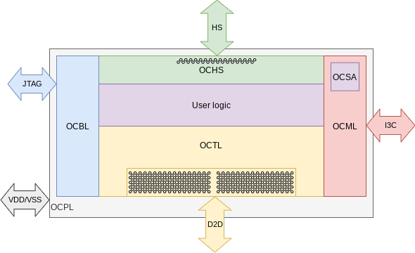
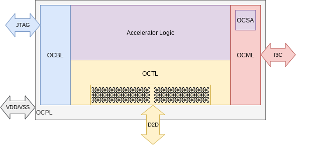
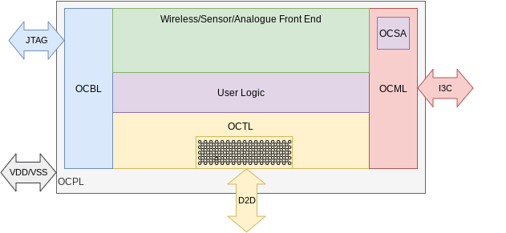
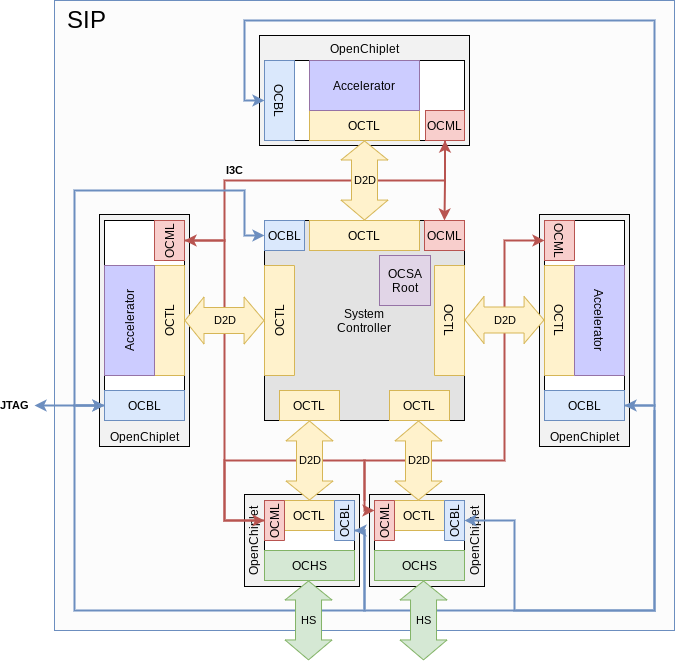
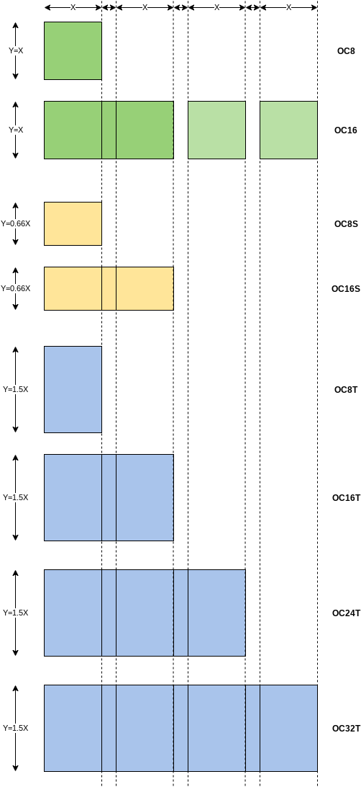
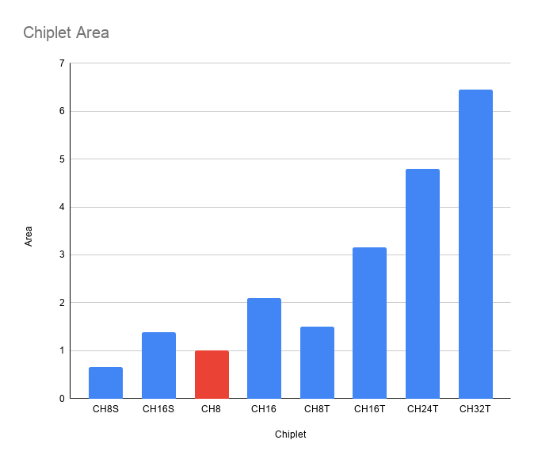

# OpenChiplet Specification

## Version: 0.1

## Date: 20210603

--------------------------------------------------------------------------------

# License

Copyright 2021 Google LLC

Licensed under the Apache License, Version 2.0 (the "License"); you may not use
this file except in compliance with the License. You may obtain a copy of the
License at https://www.apache.org/licenses/LICENSE-2.0.

Unless required by applicable law or agreed to in writing, software distributed
under the License is distributed on an "AS IS" BASIS, WITHOUT WARRANTIES OR
CONDITIONS OF ANY KIND, either express or implied. See the License for the
specific language governing permissions and limitations under the License.

--------------------------------------------------------------------------------

## Abstract

The OpenChiplet (OC) specification defines a common baseline requirements set
necessary for the development and creation of a broad range of chiplet die for
use in heterogenous, multi-die System-in-Package (SIP) applications. The
OpenChiplet specification is divided into Normative and Informative sections.
Normative specification items are mandatory requirements for any chiplet.
Informative requirements are provided as guidance for the creation of specific
chiplet solutions, and may become Normative requirements in later revisions of
this specification.

## Conventions

“shall be” : A required specification implementation item.

“may be” : An optional specification implementation item.

## Abbreviations

Abbreviation | Term
-----------: | :-------------------------------------------------
BSDL         | Boundary Scan Description Language
BoW          | ODSA Bunch-of-Wires Die-2-Die PHY
IDE          | Integrity and Data Encryption
JTAG         | Joint Test Action Group
MCTP         | Management Component Transport Protocol
OC           | OpenChiplet specification
OCBL         | OpenChiplet Build Layer
OCHS         | OpenChiplet High Speed Layer
OCML         | OpenChiplet Management Layer
OCPL         | OpenChiplet Physical Layer
OCSA         | OpenChiplet Security Agent
OCTEL        | OpenChiplet Thermal and Electrical Layer
OCTL         | OpenChiplet Transport Layer
ODSA         | Open Domain Specific Architecture
PLDM         | Platform Level Data Model
RDE          | Remote Data Entry
SECT         | Standard for Embedded Core Test
SIP          | System-in-Package
TAP          | Test Access Port

## Typography

Font           | Example
-------------: | :-----------
Variable width | General text
`fixed width`  | `IO signals`

--------------------------------------------------------------------------------

# Normative Specification

## Overall OpenChiplet Architecture

The OpenChiplet shall be implemented using a layered approach, similar to other
protocol specifications. These layers present common, defined external
interfaces and user APIs. This layered architecture is shown in figures 1, 2 and
3 below. Each defined layer is described by this OpenChiplet specification. In
summary, the layers are:

Layer | Description
----: | :-------------------------------------------------------------
OCBL  | OpenChiplet Build Layer
OCHS  | OpenChiplet High Speed Layer
OCTL  | OpenChiplet Transport Layer
OCSA  | OpenChiplet Security Agent
OCML  | OpenChiplet Management Layer
OCTEL | OpenChiplet Thermal and Electrical Layer
OCPL  | OpenChiplet Physical Layer

Figure 1 - OpenChiplet IO application

Figure 2 - OpenChiplet accelerator application

Figure 3 - OpenChiplet wireless/sensor application

## Example System-in-Package using OpenChiplet

The system shown below incorporates three OpenChiplet Accelerator dice and two OpenChiplet IO dice. A central system controller identifies the chiplets in the system and serves as the OCSA root. All the OpenChiplet dice are connected to a common I3C bus and a JTAG boundary scan chain.

Figure 4 - Example OpenChiplet System-in-Package

## OpenChiplet Management Layer (OCML)

This layer provides an out-of-band system management for the chiplet. It defines
how the chiplet is integrated into the system, and how the platform can detect,
configure, monitor and manage the chiplet(s) in the system. The software API
presented to the system controller shall also be defined here.

### Management interface

*   MIPI I3C Basic v1.0 will be used for sharing management data between
    chiplets and the central SIP controller.
*   Comprising interface signals:
    *   `OCML_SDA`
    *   `OCML_SCL`
    *   `OCML_ADDR[n:0]`
*   Consistent with I3C, the chiplet operates as a I3C target device by default,
    but may operate as an I3C initiator device, depending on the chiplet
    configuration.
*   `OCML_ADDR` (informative) is used in multi-chiplet systems where a unique
    I3C target address needs to be assigned to each chiplet instance on the
    package.

### Management identify

*   Every chiplet will provide a mechanism for the central controller to detect,
    identify, configure and triage the chiplet. The exact mechanism (eg. vendor
    ID, chiplet ID etc) is TBD.

### Management environmental telemetry status

*   Every chiplet will provide useful environmental telemetry information :
    temperature, voltage. Ideally the telemetry should be delivered in some
    standards compliant format (such as RDE, or PLDM type 10b depending on the
    chiplet’s capabilities) that does not require per device code to be
    developed for parsing and interpreting the telemetry data (TBD).

### Management operational telemetry status

*   Every chiplet will provide useful operational telemetry information :
    faults, errors and basic performance data. Ideally the telemetry should be
    delivered in some standards compliant format (such as RDE, or PLDM type 10b
    depending on the chiplet’s capabilities) that does not require per device
    code to be developed for parsing and interpreting the telemetry data (TBD).

## OpenChiplet Security Agent (OCSA)

The security requirements for a standardized chiplet can be divided into four
categories, which are implemented within the Chiplet Security Agent, residing in
the OCML. These categories are:

### Identity

*   A chiplet shall have a unique cryptographic identity embedded into the
    silicon to enable secure chiplet identity authentication
*   Depending on product and functional requirements, the chiplet may need to
    provide tamper-evidence or tamper-resistance or neither for this
    cryptographic identity. This can vary based on function -- e.g. an
    accelerator chiplet vs. an IO chiplet, or on deployment requirements --
    cages in a DC vs. a closet in a coffee shop.
*   The cryptographic identity must be generated at manufacture, with a process
    that guarantees the secrecy of the identity, and the authenticity of public
    key certificates derived from this identity.
*   PKI. The manufacturer shall offer a signed endorsement of the public
    certificate for each chiplet they produce. Details on how this database is
    structured exceed security requirements (manufacturers may choose to segment
    information across customers to avoid leaking size of business).
*   Access to certificates and public keys must be frictionless to the chiplet
    purchaser, based on a manifest indicating the serial numbers of purchased
    chiplets. This manifest may be produced at multiple times in the supply
    chain (chiplet manufacture, SoC manufacture, L6 board manufacture, L10
    system manufacture), and the end-customer must be able to correlate
    provenance and identity of chiplets at each step of the way.
*   If circular economy is a product/business requirement, access to public keys
    and certificates must be transferable.
*   The identity of the chiplet shall be query-able at runtime to establish the
    integrity of the system under use. The chiplet shall respond to a challenge
    by signing it with a key derived from its unique identity. The challenge
    must guarantee freshness against replay attacks, and the end-user should be
    able to authenticate the signature of the challenge as rooted back to the
    public identity certified by the manufacturer.
*   An SoC must be able to establish precisely that the identity of the chiplets
    it is composed of root back to genuine parts, via the above
    challenge/response mechanism. Furthermore, an SoC must be able to establish
    that the set of identities is complete and that no unexpected silicon eludes
    identification.

### Boot mechanism

*   Chiplets may use mutable firmware.
*   It is not recommended for each individual chiplet to devise a root of trust,
    attestation, and secure boot individual strategy.
*   Instead, a chiplet may allow a “supervisor” element of the system to hold it
    in reset, load the mutable firmware on its SRAM, and release it from reset
    to begin execution.
*   Firmware integrity enforcement and attestation is thus delegated to a
    single, critical “supervisor” controller within the system. This controller
    may be a chiplet itself, and will typically be the first element out of
    power-on, sequencing firmware loading and reset for other chiplets.
*   The controller must implement a measured or secured boot. This is outside
    the scope of this specification.
*   OTA (Over the Air) firmware upgrades must be negotiated with the secure
    controller to enforce authentication on upgrade.
    *   Hot-patching a chiplet during runtime with new firmware, while the rest
        of the SoC executes is outside the scope of this specification

### Key material protection and channel encryption

*   A chiplet must clearly outline its input/output interfaces, and any
    firewalling needed to separate sensitive material like keys or reference
    signals from more prosaic signaling like thermal sensing.
*   Depending on product requirements, chiplets may present different
    buses/interconnects to the rest of the SoC.
*   For example, a glitch resistant chiplet may include a reference power input.
*   For example, a chiplet performing AES encryption may have a dedicated bus to
    retrieve keys from another chiplet dedicated to tamper-evident key material
    storage.
*   If product requirements mandate an authenticated control channel, one-sided
    authentication can be achieved by encrypting control messages to the public
    key derived from the chiplet identity. This requires en/decryption
    capabilities within the chiplet, if warranted by the product.
*   Two-sided authentication may be supported if the chiplet is equipped with an
    OTP bank. This capability must be considered with care, as its costs entail
    revocation or circular economy transfers require additional OTP real estate,
    and programmable private key material in the endpoints that interact with
    the chiplet.

### Product Functionality

*   Security product functionality specific to a chiplet falls outside of the
    scope of this specification
*   For example, if the chiplet is encrypting PCIe TLPs to offer IDE
    functionality, or providing HSM capabilities, the requirements to be met by
    the chiplet are specific to those product functions

## OpenChiplet Build Layer (OCBL)

This layer covers the foundational, integration, test and DFT aspects of the
chiplet implementation.

### Reset interface:

*   The chiplet shall have a single asynchronous active-low reset interface.
    This signal shall be asserted for at least Xusec and will revert the chiplet
    to its default operating state, regardless of the current operating state.
*   Reset interface comprises signals:
    *   `OCRESET_L`

### Clocking interface: Two CML differential reference clocks.

*   Comprising interface signals:
    *   `OCREFCLK0_P/N`
    *   `OCREFCLK1_P/N`

### Built in Self-test (BIST):

*   Chiplets shall implement functional BIST. This is necessary as a means to
    diagnose if the error in the whole system is due to a specific chiplet or
    integration process. The BIST will be independent of any firmware running on
    other system dice.

### Manufacturing Test and Repairability:

*   Chiplet shall implement IEEE-1194.1/1194.6 JTAG/AC-JTAG boundary scan chain
    for all external IOs.
*   Chiplet supplier shall provide the BSDL file for the chiplet boundary scan
    chain.
*   Chiplet shall implement IEEE-1500 SECT for the die-to-die interface.
*   The chiplet IO ring TAP shall be added in series with the other boundary
    scan chain TAPs in the system.
*   Chiplet shall implement automatic memory repairability if the memory content
    of the chiplet exceeds *(TBD)*Mbits.
    *   The chiplet memory repair sequence shall occur automatically after
        `OCRESET_L` is de-asserted.
*   Chiplet shall implement lane repairability on the D2D interface where
    necessary
    *   The D2D lane repair information shall be applied automatically after
        `OCRESET_L` is de-asserted.

## OpenChiplet Thermal and Electrical Layer (OCTEL)

This layer defines the physical and electrical aspects of the chiplet
definition. Chiplet should specify the following parameters and have the
capabilities listed below.

### ESD

*   The chiplet shall have the following ESD specs for the IOs.
    *   C4-bumps (organic interposer applications)
        *   HBM: 2kV for power
        *   CDM: +/-5A for power
    *   Micro-bumps (silicon interposer/bridge applications)
        *   HBM: 100V for signal
        *   CDM: +/-0.6A for signal

### Design Support

The following collaterals shall be provided by chiplet manufacturer:

*   Data to support thermal modeling and system thermal design (for silicon-only
    chiplet):
    *   Chiplet physical dimensions:
        *   Length, Width, Z-Height
        *   Bump, Microbump or Copper Pillar layout
    *   Representative power maps showing expected heat dissipation by
        functional block.
        *   Power map granularity of 10um x 10um preferred.
    *   Maximum allowable junction temperature and corresponding target life
        (years)
    *   Spatial map of thermal sensor locations
    *   Precision and accuracy of thermal sensors
    *   Expected range of power dissipation (Watts) and power density (W/mm^2)
    *   If preferred and reference designs are available, then provide the
        thermal model files in ECXML format.
*   Electrical models:
    *   IO models in IBIS and/or Touchstone format as necessary.
*   Power domain models:
    *   In IEEE-1801 UPF format.

## OpenChiplet Physical Layer (OCPL)

The OpenChiplet **X** dimension is critical. This is governed by the beachfront
required for BoW PHY + 8 x high-speed IO pairs. All other chiplet die dimensions
are derived from the X dimension. For this initial specification, chiplet
X=2.6mm (2600um) for use with organic substrate applications.

This concept allows 2X, 3X or 4X die to be built, whilst also allowing the
smaller 1X die to be fitted N times on the same footprint as a NX. The
die-to-die spacing is silicon in 2X, 3X, 4X variants, but empty space when
populated with 1X die, meeting the die-to-die spacing constraints for the
substrate packaging.

Die size variability is achieved by adjusting the Y dimension (as a multiple of
the X dimension). A common set of Y height options is specified, and more can be
specified if needed.

In the open chiplet form-factor naming convention, OC*n* refers to the number of
high-speed TX & RX pairs available in the form-factor. There would be one BoW
PHY instance for each `X`. The suffix refers to the Y-dimension: `S`=short,
`none`=normal(square), `T` = tall. `XT` = extra-tall (Y=2X) may also be
implemented. This convention still follows for chiplets which do not implement
the high-speed layer.

Figure 5 - OpenChiplet Form Factor Dimensions

--------------------------------------------------------------------------------

# Informative Specification

## OpenChiplet Transport Layer (OCTL)

This layer defines exactly how the D2D interface transports different data to
support a wide variety of different chiplet functionalities. It shows how data
is mapped and multiplexed on to the D2D signals. This layer has been kept in the
informative section since this will be use-case specific. Protocol specific
Normative OCTL definitions will be created to support various protocols,
possible examples of which are listed below:

### D2D physical layer (BoW PHY)

*   Select the appropriate speed, based on the application.
*   Define the bump/micro-bump pitch depending on the substrate application
    required.

### Cut point between main die and chiplet die for IO chiplets

*   MAC inside chiplet. Examples:
    *   Channelized FIFO (multiple ready/valid signals):
        *   CPRI, OpenRAN
    *   Packetized FIFO (singe ready/valid):
        *   DMA interface:
            *   PCIe Controller (root complex/end-point)
            *   Ethernet MAC
    *   Protocol interface:
        *   OTN Framer
        *   FiberChannel
        *   SATA/SAS
        *   SRIO 10xN, 25xN
    *   FIFO per high-speed lane:
        *   InfiniBand
        *   JESD-204B/C
        *   HyperTransport

*   PCS inside chiplet. Examples:
    *   *x*DMII - Ethernet PCS
    *   OTN - OIF-CEI
    *   PIPE - PCI-Express, CCIX, CXL
    *   HDMI, DisplayPort, MIPI-DSI, MIPI-CSI
    *   UTMI - USB3, USB-C, Thunderbolt
    *   DFI*x* - DDR memory PHYs

*   High Speed physical layer (PMA layer)
    *   Lowest latency, but need to transport multiple clock domains via D2D.

### Optionality/expansion/offload chiplets

*   Unified host bus interface. Low latency and heavy weight, low throughput
    primitives.
    *   For homogeneous systems sharing a common memory map with the chiplet.
    *   Example: PCIe end-point on chiplet, accessed via a standard host-bus
        interface transported over the D2D PHY.

*   High bandwidth DMA + sync flag/doorbells. Low latency and low weight, high
    throughput primitives.
    *   For heterogeneous systems with independent memory map on the chiplet.
    *   Example: NVMe

### Transport layer encryption

End-to-end encryption over the transport layer may be required depending on the
application.

## OpenChiplet High Speed Layer (OCHS)

This layer defines the high-speed interface aspects of the chiplet. It would
typically reference other high-speed interface protocols and standards for all
signalling aspects. Some considerations are listed below:

*   8 and 16 high-speed lane variants utilizing similar, incremental bump maps.
    The x16 chiplet grows in one X-dimension to add 2nd copy of x8 bump-map. The
    form factor continues to x24 and x32 lanes, growing in X-dimension steps.
    *   Examples of high-speed lane support for NRZ, PAM4 and other differential
        high-speed serial interfaces.

--------------------------------------------------------------------------------

# Appendix

Figure 6 - Normalized chiplet die area for all chiplet form factor variants.
